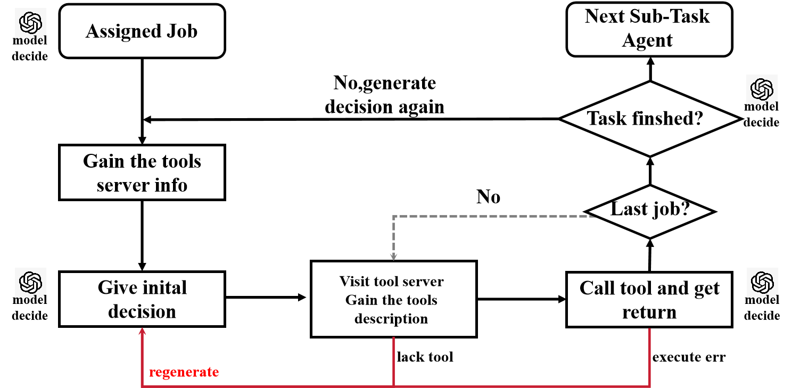

# 云原生架构下多智能体协作框架以及多智能体运维原型设计

---

## 项目目标

- 缩小平台工程师与开发人员的鸿沟，能够让开发工程师通过自然语言部署与运维应用，可以直接利用云原生集群的能力。

- 帮助运维工程师快速完成较为复杂任务的部署。比如mysql等，提高云原生工程师的工作便捷与效率

- 可以通过webhook监控集群数据，对于一些崩溃的应用，智能体能够读取日志内容并尝试修复较为简单的问题，提高应用的可恢复性。而不只是按照k8s的策略不断对应用进行重启

- 本系统暂时的设计受众是小型的开发团队对于大型团队功能需要进一步加强

- 一个愿景：本系统可以作为未来软件自动化开发的调度核心的工程验证原型，是否有可能利用本系统进行软件开发过程所有agent的统筹规划？从需求分析 -> coding expert  -> test expert -> resource schedule -> application packaging -> application maintaining

  从而实现全自动的软件开发部署上线？难度很大，但是未来可期。  

---

## 项目阶段

1. **专用于记忆存储的基于bitcask数据模型的kv数据库内核开发**
2. **针对运维/复杂环境下的多智能体框架探索**
3. **在云原生下的多智能体协作架构与框架适配**
4. **多智能体运维系统的搭建 **
5. **云原生环境下的部署简化以及集群内核兼容**

---

## 第二阶段：针对运维环境下的多智能体协作框架—ComAgent

### 整体架构


* **ExpertSession**

​		ExpertSession是ComAgent的运行核心，所有智能体的上下文管理，记忆空间维护，大模型的加载，agent的工具调用，任务的分解与执行，任务反馈机制等都运行再ExpertSession中。

* ExpertCore

  智能体的执行工作流定义。

* CacheManager

​		用于管理智能体在运行中的记忆，负责记忆append，记忆delete，记忆merge等功能。为不同的智能体进行记忆空间的管理。智能体是否在框架中注册的核心表示是是否在CacheManager中注册记忆空间。

* AgentLoader（Models Pool）

  用于大模型的装载、大模型的管理（本系统暂时不支持），大模型inference管理等功能。

* Tools Servers Pool

  用于工具服务器的管理，需要解决的是工具config管理，工具路由等功能。


### 智能体上下文

​	

#### 装载器AgentLoader

​	 此处装载器的设计较为简单，做大模型的推理或者部署管理难度太大，作者水平有限暂时忽略此部分内容。在AgentLoader可以访问到的目录下，需要存入大模型的权重文件，鉴于本系统为工程原型，此处只支持装载safetensor格式的大模型权重文件。接口通过flask开放，此处较简单不进行过多描述。

​	大模型的装载采用torch、tansformer库等内容，较简单不表。

#### 专家智能体Expert—任务的统筹者

​	expert的职责：

1. 获得人类的输入或者是任务描述。
2. 根据任务，按照给定的生成prompt模板生成相应的解决方案。
3. 根据Job Supervisor的输出与bitmap的情况判断任务是否完成，任务完成则等待用户/hook再次输入/获取信息，任务未完成则获取失
4. 败agent信息，并给出解决方案，是重新生成方案释放之前的task agent还是重新执行某些task agent（prompt2）
5. 需要有检索记忆空间的能力，如果本次任务生成内容不是initial input（prompt1），在每次发送任务给AgentLoader获得输出之前需要检索记忆空间的内容（prompt 3），之后的输出需要附带上之前的记忆信息(prompt 4)

* prompt1 (initial chat)

```json
你是一个专家智能体，下面是用户的任务大致描述
{job_description}
请对用户表示欢迎使用本系统等内容,你返回的内容会被保存在记忆空间中
```

* prompt2 (tasks status)

```json
下面是我给你当前任务执行信息
任务执行状态：{status} #"1":任务成功 "0":任务失败
失败智能体状态：{info} # 会详细记录任务智能体的失败状态 
记忆信息{memory}  # 由任务所决定的所需记忆内容在后台查找后会添加到这个位置
配置:{config} # 一些必要的配置信息以复制决策
# todo: 添加任务服务器的任务配置，给与任务服务器中所提供的大致工具信息辅助决策
下面是你的回答，请使用json格式进行回答，并使用<start_json>与<end_json>将生成的内容包裹方便解析
如：
<start_json>
{{
     status:1/0, # 请回答0或者1，如果是1，后面的字段全部无效。只有为0才需要生成后面的字段
     restart:1/0, # 如果是1就会重新读取任务的描述重新生成任务链路，该任务链路需要避免之前任务执行的错误，如果是0
     modified_tasks:{{ # 该字段是读取异常之后重新调整的任务
         sub_tasks:[
 			{{
                id:1,
                description:"子任务描述"
                return: "任务返回内容"
            }},
			{{
                id:2,
                description:"子任务描述"
                return: "任务返回内容"
            }},
            ...  
        ],
        "dependcies":{{ # 任务之间的依赖关系
            "1":[],
            "2":["1"],
        ...
        }},
        memory:{{
            此处添加简易的记忆内容如当前任务信息等内容
        }}
    }}
            
 }}
<end_json>

```

* prompt3 (memory search)

```json
你自己选择该任务需要读取哪些部分记忆信息
任务内容:{tasks_description}
附加信息:{info}
下面是你的回答，需要你按照下面的格式进行决策，请使用json格式进行回答，并使用<start_json>与<end_json>将生成的内容包裹方便解析
如：
<start_json>
{{
	"task_key_word":["关键字1"，"关键字2",.....], # 用于搜索任务描述历史记忆空间
	"output_key_word":["关键字1"，"关键字2",.....], # 用于搜索决策历史历史空间
	"jobs_key_word":["关键字1"，"关键字2",.....], # 用于搜索任务执行情况历史空间
	... #后续会添加更多的搜索方式，看数据库层所提供的搜索接口，暂时设置为需要同时对三个空间进行搜索
}}
```

* prompt4 (task input)

```json
下面是我给你当前任务执行信息
任务描述:{task_description}
记忆信息{memory}  # 由任务所决定的所需记忆内容在后台查找后会添加到这个位置
配置:{config} # 一些必要的配置信息以复制决策
# todo: 添加任务服务器的任务配置，给与任务服务器中所提供的大致工具信息辅助决策
下面是你的回答，请使用json格式进行回答，并使用<start_json>与<end_json>将生成的内容包裹方便解析
如(一定要严格按照下面的格式否则会出错)：
<start_json>
{{
    sub_tasks:[
 		{{
            id:1,
            description:"子任务描述"
            return: "任务返回内容"
        }},
		{{
            id:2,
            description:"子任务描述"
            return: "任务返回内容"
        }},
        ...  
    ],
    "dependcies":{{
        "1":[],
    	"2":["1"],
    ...
    }},
    memory:{{
        此处添加简易的记忆内容如当前任务信息等内容
    }}
}}
<end_json>

```

​	这里其实需要提醒一下自己最好需要对一个agent的记忆空间类型进行区分，这样便于agent对记忆空间进行搜索，由其决定检索记忆空间的哪一些部分。

* 工作流的定义

#### 任务智能体sub-task agent任务的执行者

​	sub-task agent构建过程中比较困难的地方在于agent不一定仅仅通过单一的方法就可以解决expert所分配的问题，所以此处需要设计好sub-task agent工作的生命周期。如果这个系统需要走得更远expert所分配的任务大概率不是一个function就可以解决的问题，所以肯定是需要sub-task-agent能够搞定复合任务的，需要有独立处理任务的能力。

​	

* prompt1（Tool服务器层决策）：

```json
你是一个子任务智能体服务于专家智能体的需求,你只需要输出下面输出格式中的内容
下面是不同服务器所提供的工具类型的数据：
"{tool_server_info}"
你的任务是:
"{sub_task_description}"
你最终返回给下一个智能体的数据是：
”{return_content}“
下面给出你的初步决策，每一步的决策尽可能简单,仅可以使用单一Tool完成
决策输出格式为(注意其余的信息都不要进行生成)：
<start_json>
{{
 	"jobs":[
 	"0":{{
 		"func_describe":"此处描述需要用的工具",
 		"server_id": "根据server信息给出工具会属于的server",
	}},
	"1":{{
 		"func_describe":"此处描述需要用的工具",
 		"server_id": "根据server信息给出工具会属于的server",
	}}, # ....根据自己需要添加 
    ]
}}
<end_json>

```

* prompt2: 

```json
你是一个子任务智能体服务于专家智能体的需求,你只需要输出下面输出格式中的内容
    下面是{server_id}服务器所提供的工具详细数据的数据：
    "{tools_info}"
    你的任务是:
    "{job_description}"
    下面给出你的初步决策，每一步的决策尽可能简单,仅可以使用单一Tool完成
    决策输出格式为(注意其余的信息都不要进行生成,xxx是你需要填充的内容，你只允许调用一个工具)：
    <start_json>
    {{
     	tool_id:"xxx"
     	tool_name:"xxx"
     	tool_parameter:[
     	    parameter1: "xxx" 
     	    parameter2: "xxx"
     	    ... 
     	]
    }}
    <end_json>
    若Tool 无法满足需求则返回
    <start_json>
    {{
     	error: "tool can not satisfy the requirement"
    }}
    <end_json>
```


* prompt3: 

```json
        你是一个子任务智能体服务于专家智能体的需求,你只需要输出下面输出格式中的内容
        你需要对前面链路的工具调用情况进行汇总
        你的需要汇总的数据有:
        "{execute_status}"
        你需要向下一个智能体传递的内容：
        "{return_content}"
        决策输出格式为(注意其余的信息都不要进行生成,xxx是你需要填充的内容)：
        <start_json>
        {{
            "execute_status": "success/error(decided by the execution info)",
            "return_content": {{
                "content1": xxx,
                "content2": xxx,
                // 可以根据需要继续添加更多内容
            }}
        }}
        <end_json>
        若需要重新规划任务
        <start_json>
        {{
         	error:"restart"
        }}
        <end_json>
         '''
```


* 接口定义如下:

```python
     """
    @Function:搜索数据库中的工具信息？还是下放到ComToolPool
    """
    def search_corresponded_call(self,tool_describe):
    """
    @Function:工具调用
    """
    def call_tool(self):
    """
    @Function: 获得指定空间中的工具信息
    """
    def gain_tool_config(self,tool_path):
    """
    @Function: 执行任务
    """
    def execute(self,prefix_ids):
```


#### ExpertSession（框架最小执行单元）

​	这个ExpertSession初步的设计想法是可以直接将其看成是一个AI systeWm的核心，后续还可以实现多MultExpertSession进一步提高复杂程度以适配复杂系统，故AI执行单元的数量可以灵活的按照任务来进行分配。

* boot流程
  * 检查组件连接是否正常
  * 判断是否需要人类的介入/时候需要expert agent初始化
  * 
* 

#### CacheManager

​		cacheManager的核心功能：对接ComDB的记忆空间管理机制，为智能体提供更为完善的记忆机制 。详细功能：1. comdb_client 功能。2. 定时merge记忆空间（数据库层面的功能）。 3.  Compress的触发，在cacheManager中会为每一个agent维护一个当前对话轮数，当论数达到用户说设定的阈值之后就会触发该智能体记忆空间的压缩。

---


### DAG任务图——智能体调度

#### 粗粒度调度

​	

#### 细粒度动态调度

#### Task Decomposer

#### Job Supervisor


---

### Tool Pool—Agent工具池

​	在智能体运维的过程中，不可避免要让智能体调用工具使用k8s的api server或远程操作节点完成运维相关操作。为了让智能体更加适应云原生架构，我们将所有需要使用的工具封装到Tool Server中，agent能够向Tool sevrer请求工具信息并且调用工具。此处需要提供一套Tool Server的api使用规范。

​	Tool Pool设计的目的是为了较好的管理不同的server服务器更好的为agent提供api服务。Tool Pool有两大功能：工具信息聚合：整理不同Server的信息并给agent提供汇总，Tool Server分区: 将不同类型的Tool分区之后按照不同的类型进行分布式的路由以防止单点server的“工具爆炸”。

​	针对ToolPool此处提供两套不同的解决方案：

* 稳健版本：由用户注册其编码好的Tool Server
  * Tool Server向Tool Pool进行注册，注册之后的相关信息会被保存在数据库中，这样可以保证Tool Server每次重启都可以访问其Tool Server。
  * Tool Pool 对向其注册的Tool Server进行工具数量的校验以及连接的校验。并进行定时的心跳访问测试可达性。
  * Tool Pool为不同Server维护一个meta表，表中维护了Tool server的工具类型，ip，port，工具大致信息
  * Tool Pool根据智能体的需求在其维护的数据库中搜索符合的工具信息。（这个搜索要怎么做确实是一个很大的问题），此处还起到了一个网关的功能。这里写一个sprintboot似乎还是非常方便的。


* Beta版：用户传入tool_config.json之后，由智能体对工具代码进行编写并自主部署Tool Sever（此处需要基于基础服务器，也就是会有一个默认的操作K8S的服务器）

#### Tool server设计

* API规范

  * POST /register

    ```json
    # from tool server request:
    {
      "tool_type": "k8s_manage_tool",
      "tool_server_description": "Kubernetes 集群管理工具",
      "server_ip": "192.168.1.100",
      "server_port": 8080,
      "health_check_endpoint": "/health"
    }
    
    # from ComToolPool response:
    {
      "status": "success",
      "tool_id": "1"
    }
    ```

  * POST/tools 

    ```json
    # 调用
    # 查询参数：
    # tool_type：工具类型（可选）
    # tool_name：工具名称（可选）
    # tool_server_id: 工具服务器ID
    # response：
    {
      "tools": [
        {
          "tool_id": "1",
          "tool_type": "k8s_manage_tool",
          "tool_name": "xxx",
          "server_ip": "192.168.1.100",
          "server_port": 8080
        }
      ]
    }
    ```

  * POST /tools/{tool_id}/execute

    ```json
    {
      "parameters": {
        "xxx": "xxx",
        "xxx": "xxx"
      }
    }
    
    {
      "status": 1,
      "return ": "xxx"
    }
    ```

  * GET /health

    ```
    {
      "status": "UP",
      "last_heartbeat": "2023-10-01T12:00:00Z"
    }
    ```

  * GET/tool-server

    没有携带参数，获取tool-server信息

  * DELETE /unregister

    ```
    {
      "tool_id": "1"
    }
    
    {
      "status": 1
    }
    ```

#### Tool server分区

------------------

### CacheManager—记忆空间构建

#### 记忆更新机制


#### 记忆搜索算法


------------------

### 架构“云原生化”


暂时的适配思路如下（此处并未进行任何实验只是简单的设计）：

​	decomposer，ExpertContext从原来的ExpertSession拆除出去，ExpertContext用于管理Expert Agent在会话中的内容，此处需要进行接口化微服务化。Job supervisor也需要拆出去。将这些容器放到一个pod中进行管理，我现在的设计是将三者进行配套，这样设计或许会很消耗资源，后续再进行调整。

 所有的sub-task agent封装为job，计算容器创建之后一旦任务完成就会被k8s自动销毁。当然也可以设计由supervisor进行控制计算容器的生命周期。


